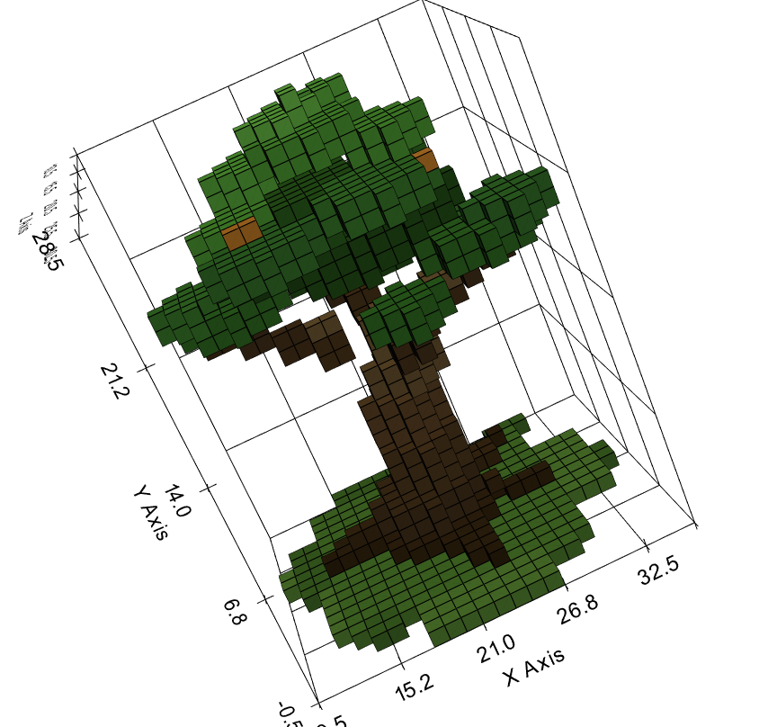
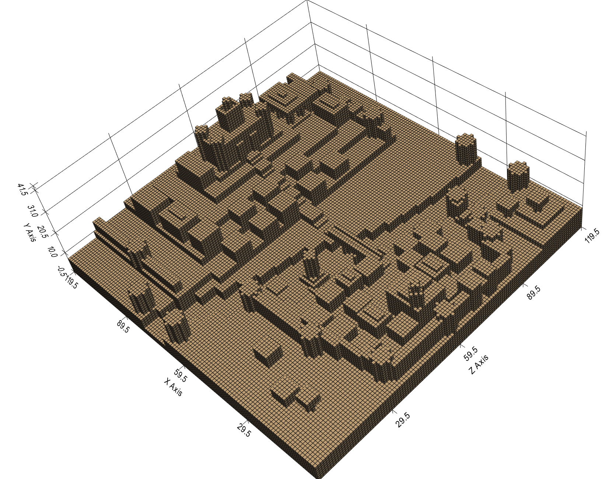

# Basic Map maker w/mcp server

The goal is allow an agent to dynamically generate and update maps following users request

## Components

### Map Engine

- Allows for the addition/removal of blocks within a pre-established 3d space
- Maintain a grid with the allocated blocks

### Rendering Engine

- Displays a 3d space divided by uniform blocks

### Mcp API

- Get current state of the plane
- Update areas
- Fetch available pre-made structures

## Demo 1

### Viewer



### Prompt used

```
Using the mapmaker tools, create a map of size 40 and grow a large, realistic oak tree.
Think like a sculptor, not a builder:

The trunk is not a cylinder — it's a stack of cylinders that shrink as they rise, shift off-axis slightly to give the trunk a lean and a curve, with a wide flared base where roots grip the ground
Two or three major boughs branch off partway up: angled runs of small offset fills or thin cylinders, each thinning as it goes
The canopy is not a ball — it's many overlapping leaf clusters of different sizes at different heights, denser in the middle, with a few gaps where sky shows through, and a couple of small clusters sitting lower on the boughs
Roots: short, partly-exposed runs radiating from the base

Use color for depth, not just identity: darker browns low on the trunk and on the underside of boughs, lighter bark higher up; at least three greens in the canopy — darkest in the interior clusters, brightest on the outer, sun-facing tops. Scatter a few autumn-touched blocks if it suits the tree.
Ground it: a patch of grass-colored floor around the base, uneven at the edges.
Plan the silhouette first — describe the tree's shape and character in a sentence or two — then build it in many small operations. 0-indexed, y is up. When done, tell me how old this tree feels and why.
```

## Demo 2

### Viewer



### Prompt Used

```
Using the mapmaker tools, create a map of size 120 and build a fortified river city. A river winds through it — not a straight channel, something with bends and varying width, the way real rivers cut through terrain. The city grew around the river: older, denser construction near the water, grander structures on higher ground, defenses where the geography demands them rather than in a neat square.
You have fill, hollow_box, and cylinder — but don't think of structures as single primitives. A convincing shape is usually many small overlapping operations: a winding river is dozens of short offset segments, a hill is stacked shrinking layers, a ruined wall is fills with irregular tops. Fidelity comes from composition, not from the primitive.
Plan the character of the city first — its geography, its districts, its story — then build it. Take as many operations as the vision needs. Coordinates are 0-indexed, y is up, 120³ space. When done, describe what a traveler arriving by the river would see.
```
